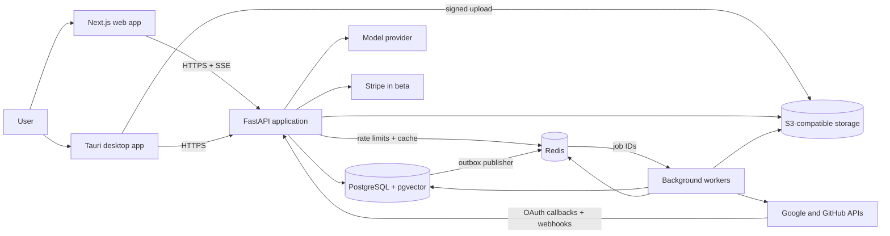
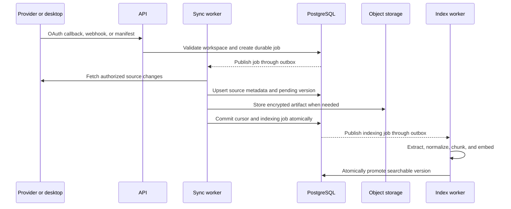

# System Architecture

> **Implementation status:** Specification complete; runtime implementation is
> partial. Application/process shells and local dependencies exist, while the
> durable product services remain unimplemented. See
> [`IMPLEMENTATION_STATUS.md`](IMPLEMENTATION_STATUS.md).

## Architecture goals

The system must provide tenant-safe retrieval, reliable background ingestion,
grounded streamed answers, and complete deletion without requiring a large
operations team. The architecture optimizes for a small team and one vertical
slice first, while preserving clear boundaries that can be extracted later.

## Architecture principles

- Start with a modular backend monolith and separate worker processes.
- Treat a workspace as the tenant and authorization boundary.
- Keep PostgreSQL as the source of truth; Redis and caches are disposable.
- Make background jobs idempotent, retryable, and observable.
- Keep provider-specific behavior behind connector interfaces.
- Never expose a partially indexed document version.
- Treat retrieved content as untrusted data, never as instructions.
- Prefer explicit contracts over shared database access between components.
- Extract a microservice only after measured scale, reliability, or ownership
  pressure justifies the operational cost.

The accepted modular-monolith decision is recorded in
[`architecture/decisions/0001-modular-monolith.md`](architecture/decisions/0001-modular-monolith.md).

## System context



No browser or desktop client connects directly to PostgreSQL, Redis, or object
storage. The one exception is a short-lived, narrowly scoped signed object
upload issued by the API to the desktop client.

## Technology baseline

| Area | Choice | Boundary |
| --- | --- | --- |
| Web | Next.js, React, TypeScript strict mode | Presentation, browser session handling, SSE consumption; no direct database access |
| Backend | Python 3.12+, FastAPI, Pydantic, SQLAlchemy 2.x, Alembic | HTTP contracts, authorization, orchestration, and shared domain modules |
| Workers | The backend Python package with separate process entry points | Sync, parsing, indexing, reconciliation, and deletion; no public HTTP API |
| Desktop | Tauri, Rust, React, TypeScript | User-approved filesystem access, hashing, manifests, watching, and offline queue |
| Primary data | PostgreSQL with `pgvector`, `pg_trgm`, and `citext` | Durable metadata, normalized text, search indexes, job state, and transactional outbox |
| Ephemeral data | Redis | Queue transport, leases, rate limits, and short-lived cache; never the only copy of durable state |
| Blob data | S3-compatible object storage | Encrypted extracted content and large artifacts addressed by opaque keys |
| AI integration | Model-provider adapter, initially backed by the OpenAI API | Embeddings and answer generation behind application-owned interfaces |
| Contracts | OpenAPI plus generated TypeScript types | Versioned API boundary shared by web and desktop clients |

Exact dependency versions are locked during the foundation implementation and
updated deliberately through tested pull requests.

## Repository and module boundaries

```text
apps/
  web/                    Next.js application
  api/                    FastAPI process entry point
  worker/                 worker process entry points
  desktop/                Tauri application
packages/
  shared-types/           generated API types and shared schemas
  ui/                     reusable presentation components
  connector-sdk/          connector contract and test kit
connectors/
  gmail/
  google-drive/
  github/
  desktop/
infrastructure/
  docker/                 local images and Compose support
  terraform/              production infrastructure modules
tests/
  integration/
  contract/
  e2e/
  evals/
```

The backend is organized by domain modules such as `auth`, `workspaces`,
`connections`, `sources`, `indexing`, `search`, `conversations`, and `privacy`.
HTTP handlers call application services; application services depend on domain
interfaces; database, queue, provider, storage, and model clients implement
those interfaces. API handlers do not contain indexing logic, and provider
modules do not bypass application services to write arbitrary tables.

## Component responsibilities

| Component | Owns | Must not own |
| --- | --- | --- |
| Web application | Authentication screens, onboarding, search/chat UI, source browser, connections, settings, SSE rendering | Provider credentials, filesystem access, database queries, authorization decisions |
| API application | Authentication, workspace authorization, OAuth/webhook ingress, request validation, search/chat orchestration, signed upload issuance | Long-running parsing, bulk sync loops, durable job execution |
| Sync worker | Provider pagination, cursor advancement, normalized source emission, reconciliation | Search ranking, answer generation, UI state |
| Index worker | Validation, extraction, normalization, chunking, embedding, atomic searchable-version promotion | OAuth callbacks, user sessions, provider selection UI |
| Delete worker | Connector/account deletion state machine, object cleanup, reconciliation, completion reporting | General sync or indexing work |
| Desktop application | Folder consent, scan, hash, watch, local queue, manifest submission | Cloud credentials, direct database access, provider writes |

## Data ownership

- PostgreSQL is authoritative for identities, workspace membership,
  connections, source metadata, searchable versions, conversations, job state,
  deletion state, and audit events.
- Object storage holds large encrypted artifacts. PostgreSQL stores opaque
  object keys and the lifecycle state needed to reconcile deletion.
- Redis may lose all data without losing durable product state. Durable jobs
  are created in PostgreSQL and published through a transactional outbox;
  reconciliation republishes jobs after queue loss.
- Provider cursors advance only after the corresponding durable changes commit.
- Queue messages contain identifiers and operation metadata, not document or
  email bodies.

The database schema and row-level security policies are owned by
[`04_DATABASE_SCHEMA.md`](04_DATABASE_SCHEMA.md).

## Request path

1. The client sends an authenticated query with a request ID.
2. The API validates the session, resolves workspace membership, and sets the
   trusted transaction-local workspace context.
3. The query planner normalizes intent and validates supported filters.
4. Keyword and vector retrieval execute concurrently with workspace predicates
   inside each database query.
5. Candidate results are fused, deduplicated, permission-checked, and reranked.
6. The context builder selects bounded passages and labels them as untrusted.
7. The model adapter produces structured claim units using only supplied
   context.
8. The API buffers each claim until the citation validator rejects unknown
   source or chunk identifiers and confirms the material claim has citations;
   only validated units are emitted to the client.
9. The API persists the completed message and citations, then terminates the SSE
   stream with usage and timing metadata.

If the client disconnects, the API cancels avoidable model work. An interrupted
answer is not presented as completed; a retry uses a new request while
preserving the prior user message safely.

## Ingestion path



Every worker operation uses a stable idempotency key. A failed replacement
leaves the previous searchable version active. Poison jobs move to a dead-letter
state with a sanitized user-visible error and an operator-visible diagnostic.

## Deletion path

1. The API reauthorizes the request and requires explicit confirmation.
2. The connection or account enters `deleting`; new sync and search access stop.
3. Stored provider credentials are revoked when supported and deleted
   immediately.
4. A durable deletion job removes active database content and object-storage
   artifacts in bounded, retryable batches.
5. A reconciliation pass proves no active derived content remains and records a
   content-free audit result.
6. The deletion status becomes `completed` within the product's 24-hour target.
7. Encrypted backup copies expire under the documented backup-retention policy
   and are not restored into an active account.

Deletion work uses a separate queue and worker pool so ingestion load cannot
starve privacy requests.

## Tenant isolation and trust boundaries

- Every tenant-owned row contains `workspace_id`, directly or through a schema
  relationship that preserves row-level security.
- The API derives workspace context from the authenticated session, never from
  an untrusted header alone.
- Every retrieval includes the workspace predicate before keyword or vector
  ranking. Global retrieval followed by application-side filtering is forbidden.
- Workers load workspace context from a durable job record and set the same
  trusted database context used by the API.
- Signed desktop uploads are restricted by workspace, device, object key, size,
  checksum, content type, and expiry.
- OAuth state, webhook signatures, desktop requests, and replay protection are
  verified at their ingress boundaries.
- External content is never allowed to select tools, URLs, system prompts, or
  authorization scope.

## Synchronous and asynchronous boundaries

Synchronous requests are limited to authentication, metadata reads, search and
chat orchestration, status changes, and validated job creation. Provider sync,
parsing, embeddings, reindexing, exports, and deletion run asynchronously.

The API returns an operation or job identifier for asynchronous work. Clients
poll a status resource initially; server-pushed job updates may be added later
without changing the job state model. Internal calls have explicit timeouts,
bounded retries with jitter, and request/job correlation IDs.

## Deployment units

| Unit | Runtime and scaling signal |
| --- | --- |
| `web` | Next.js runtime; scales on request volume and latency |
| `api` | FastAPI backend image; scales on CPU, request count, and latency |
| `worker-sync` | Backend image with sync entry point; scales on provider queue depth subject to provider limits |
| `worker-index` | Backend image with index entry point; scales on index queue depth and embedding throughput |
| `worker-delete` | Backend image with delete entry point; reserves capacity for deletion deadlines |
| `desktop` | Signed end-user package; releases independently from cloud deployment |

The API and all cloud workers use the same immutable backend image with
different commands. This avoids configuration drift while retaining independent
scaling and failure isolation.

## Docker placement

Docker is introduced during project foundation. Local Docker Compose provides
PostgreSQL with pgvector, Redis, MinIO, and a test mail server as specified in
[`19_LOCAL_DEVELOPMENT.md`](19_LOCAL_DEVELOPMENT.md). Application processes may
run on the host during early development, but CI must build the shared backend
image and web image before the foundation milestone is complete.

Production uses the same tested immutable images with managed PostgreSQL,
Redis, and object storage; it does not run the local Compose topology. Image
scanning and deployment are specified in
[`11_DEPLOYMENT_AND_INFRASTRUCTURE.md`](11_DEPLOYMENT_AND_INFRASTRUCTURE.md).

## Failure and degradation behavior

| Dependency or failure | Required behavior |
| --- | --- |
| Redis unavailable | Reject new background operations as retryable or retain them in the durable outbox; continue safe database reads; never report an unpublished job as lost |
| Model provider unavailable | Keyword/vector search remains available; answer generation returns a retryable, cited-search fallback rather than an invented answer |
| One connector provider unavailable | Other providers and existing indexed content remain searchable; affected syncs back off without advancing cursors |
| Object storage unavailable | Metadata reads and content-independent search may continue; ingestion and deletion reconciliation remain pending and visible |
| Embedding provider unavailable | Existing hybrid search continues; new versions remain unpromoted until complete |
| Worker crash or duplicate delivery | Lease expires and the idempotent job resumes without duplicate visible content |
| Database unavailable | Fail closed; do not fall back to unscoped caches or claim writes succeeded |

## Availability, recovery, and observability targets

- Public beta API availability: 99.5% monthly.
- Production API availability: 99.9% monthly.
- Durable-data recovery point objective: 15 minutes.
- Service recovery time objective: 2 hours.
- External-provider incidents are reported separately, while the product still
  measures its own degraded behavior.
- API requests, jobs, provider calls, model calls, and deletion batches carry
  correlation IDs across logs, traces, and metrics.
- Health endpoints distinguish process liveness from dependency readiness.

Restore tests must prove tenant isolation and deletion tombstones are preserved,
not merely that a database can start.

## Microservice extraction criteria

A module may become a service only when at least one condition is measured and
documented:

- It needs independent scaling that separate processes cannot provide.
- Its failures repeatedly threaten unrelated workloads despite queue and
  process isolation.
- A dedicated team owns its contract and release lifecycle.
- It requires a materially different security or compliance boundary.

Extraction requires a versioned interface, ownership of its data, failure and
rollback plans, observability, load evidence, and an architecture decision
record. Code organization alone is not a reason to add a network boundary.

## Product requirement coverage

| Requirement | Architectural support |
| --- | --- |
| `AUTH-001` | API-owned authentication and session boundary |
| `DESKTOP-001` | Signed desktop unit with scoped upload protocol |
| `GOOGLE-001` | API OAuth ingress and isolated Google connector modules |
| `GITHUB-001` | API webhook ingress and isolated GitHub connector module |
| `SYNC-001` | Durable job state, sanitized errors, and correlation IDs |
| `SEARCH-001` | Workspace-scoped parallel keyword and vector retrieval |
| `ANSWER-001` | Bounded context, model adapter, and structured output validation |
| `CITATION-001` | Stable source/chunk identifiers and citation validation |
| `CONNECTION-001` | Dedicated deletion state machine and worker capacity |
| `ACCOUNT-001` | Immediate access cutoff plus tracked, reconciled deletion |
| `SAFETY-001` | Untrusted-content boundary and no content-triggered tools or URLs |

## Stage 02 completion criteria

- Every deployment unit has explicit responsibilities and prohibited ownership.
- Durable and ephemeral data ownership is unambiguous.
- Query, ingestion, and deletion paths define authorization, atomicity, and
  failure behavior.
- Tenant and external trust boundaries fail closed.
- Local and production Docker responsibilities are placed in their owning
  stages.
- Every stage-01 product requirement maps to architectural support.
- The modular-monolith decision has an accepted architecture decision record.
- `./scripts/validate-architecture.sh` passes.
