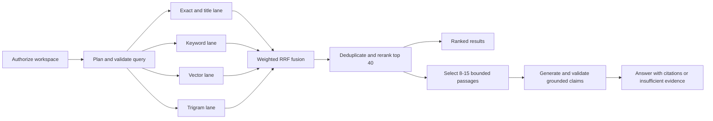

# Search Engine Design

## Goals and scope

The search engine retrieves only the current workspace's indexed, authorized
content and supports both ranked search results and grounded answer context. It
must handle natural-language queries, exact identifiers, metadata filters, and
cross-source questions without allowing a model or retrieved document to widen
access.

The MVP searches the product's local index. Live queries to Gmail, Google
Drive, GitHub, or a desktop device are deferred: they make authorization,
latency, result reproducibility, and deletion behavior harder to guarantee.
`needs_live_search` therefore remains `false` in the MVP. A later live-search
adapter requires a separate design and must never activate silently.

The search engine owns query interpretation, candidate retrieval, fusion,
ranking, deduplication, context selection, and grounding validation. The HTTP
shape is owned by [`05_API_SPECIFICATION.md`](05_API_SPECIFICATION.md), storage
and indexes by [`04_DATABASE_SCHEMA.md`](04_DATABASE_SCHEMA.md), ingestion and
chunking by [`07_INDEXING_PIPELINE.md`](07_INDEXING_PIPELINE.md), and evaluation
operations by [`12_TESTING_AND_EVALUATION.md`](12_TESTING_AND_EVALUATION.md).

## Non-negotiable invariants

- Resolve the authenticated user and trusted workspace context before planning
  or retrieval.
- Apply workspace, connection, deletion, and searchable-version predicates
  inside every retrieval lane. Global retrieval followed by application-side
  filtering is forbidden.
- Explicit user filters can narrow access but can never expand it. Inferred
  filters never override explicit filters.
- Search only fully promoted document versions from active, authorized
  connections. Deleted, deleting, revoked, pending, and superseded content is
  ineligible.
- Treat query text and retrieved content as untrusted data. Neither can select
  tools, change instructions, fetch arbitrary URLs, or alter authorization.
- Preserve stable source and chunk identifiers throughout retrieval, context
  construction, answer generation, persistence, and citation rendering.
- Return an honest no-results or insufficient-evidence outcome instead of
  relaxing permissions, removing explicit filters, or inventing an answer.

## Search modes and terminology

The same retrieval pipeline serves two modes:

- `results`: return ranked sources and snippets without model generation.
- `answer`: select bounded context and produce validated claims with citations.

A **source** is one provider item, such as an email, file, pull request, or
local document. A **document version** is a fully indexed representation of a
source at a point in time. A **chunk** is the smallest independently retrievable
passage. A **narrow section** is a heading, email message, code symbol, page, or
other local subdivision recorded by the indexer.

The canonical provider values are `gmail`, `google_drive`, `github`, and
`local_files`. Presentation labels such as "Drive" or "Desktop" map to these
values at the API boundary and are not stored as additional provider types.

## End-to-end retrieval flow



All retrieval lanes may execute concurrently after authorization and filter
validation. A lane failure follows the degradation rules below and cannot
remove access predicates from another lane.

## Query planner contract

The planner produces a versioned internal object. It is not an authorization
decision and is not the public API request or response.

```json
{
  "planner_version": "1",
  "intent": "answer",
  "normalized_query": "what did maya decide about payment retries?",
  "semantic_query": "Maya decision payment retry policy",
  "entities": [
    {"type": "person", "value": "Maya", "source": "inferred"}
  ],
  "exact_terms": [
    {"type": "quoted_phrase", "value": "payment retries"}
  ],
  "filters": {
    "providers": ["gmail", "github"],
    "people": ["Maya"],
    "repository_ids": [],
    "folder_ids": [],
    "source_types": [],
    "file_types": [],
    "date_from": null,
    "date_to_exclusive": null
  },
  "needs_live_search": false
}
```

Supported intents are `answer`, `find`, `summarize`, `compare`, `timeline`, and
`code_search`. Unknown intent values fail schema validation and use `find` for
results mode or `answer` for answer mode.

Planning proceeds in this order:

1. Validate request size, mode, and explicit filter syntax.
2. Normalize a search copy of the query while retaining the exact original.
3. Extract exact terms and deterministic filter syntax.
4. Resolve explicit repository and folder references to authorized immutable
   IDs inside the workspace.
5. Optionally use the planner model to infer intent, entities, and a semantic
   rewrite under a strict schema and timeout.
6. Merge inferred values with explicit filters, with explicit values taking
   precedence, then validate the complete plan again.
7. On planner timeout, invalid output, or low confidence, fall back to the
   deterministic plan; retrieval still runs.

The planner model receives only the query and allowed filter vocabulary. It
does not receive credentials, membership data, arbitrary database rows, or a
tool interface. Its output cannot introduce a workspace, connection, source,
repository, or folder outside the server-resolved allowlist.

## Query normalization and exact terms

The engine keeps both `original_query` and `normalized_query`. Normalization:

- rejects an empty query and enforces the API-owned length limit;
- applies Unicode NFKC to the search copy;
- collapses repeated whitespace and case-folds ordinary prose;
- preserves quoted phrases and the original form of case-sensitive code;
- identifies filenames, paths, email addresses, issue and pull-request
  numbers, commit hashes, UUIDs, error codes, and code symbols;
- does not strip punctuation that belongs to an identifier; and
- never changes stored excerpts or citation text.

Exact terms are typed rather than passed directly into SQL or PostgreSQL query
syntax. The database adapter uses bound parameters and constructs safe search
expressions. User-provided `tsquery`, regular expressions, SQL fragments, and
vector literals are never executed.

## Filter semantics

Supported filters are provider, person, date range, repository, folder,
source type, and file type. Their behavior is deterministic:

- Different filter fields combine with `AND`; multiple values within one field
  combine with `OR`.
- `date_from` is inclusive and `date_to_exclusive` is exclusive. Values are
  converted to UTC after applying the user's declared time zone.
- Date filtering uses the connector-normalized `source_timestamp`: sent time
  for email, provider-modified time for files, authored time for commits, and
  provider-created time for issues and pull requests. The result exposes which
  timestamp was used.
- Person matching uses connector-normalized author, sender, recipient, owner,
  or participant identities. Display-name-only matches rank below an exact
  normalized email or provider identity.
- Repository and folder display names must resolve to authorized immutable IDs;
  ambiguous names produce a validation error with safe choices.
- File types are normalized MIME families or extensions. Source types are
  product concepts such as `email`, `file`, `issue`, `pull_request`, or
  `commit`.
- Explicit filters remain active even when they yield no candidates. The UI may
  suggest a broader follow-up, but the server never broadens automatically.

## Candidate eligibility and tenant isolation

Before calculating relevance, every lane constrains candidates by the trusted
workspace context and requires:

- an active connection still covered by its recorded read-only grant;
- a non-deleted source within the selected providers and resolved scopes;
- the source's currently promoted searchable document version; and
- all explicit metadata filters in the validated plan.

PostgreSQL row-level security is defense in depth, not a replacement for these
predicates. Each database call sets the trusted transaction-local workspace
context. Cache keys, temporary tables, and reranker inputs also remain
workspace-scoped. A query that cannot establish that context fails closed
before retrieval.

## Retrieval lanes

The MVP retrieves a bounded pool from four complementary lanes:

| Lane | Baseline candidate cap | Behavior |
| --- | ---: | --- |
| Exact/title | 50 | Exact identifier, quoted phrase, source title, filename, path, issue number, commit hash, and code-symbol matching |
| Keyword | 100 | PostgreSQL full-text retrieval over normalized chunk text and selected title fields using a safe language configuration |
| Vector | 100 | Cosine nearest-neighbor search using the active query and chunk embedding version |
| Trigram | 50 | Typo-tolerant title, filename, path, and symbol matching using `pg_trgm` |

Candidate caps are configuration values, but changing them requires benchmark
and latency comparison. At most 300 unique candidates enter fusion. The engine
records truncation when a lane reaches its cap.

Keyword retrieval uses the indexed document language when supported and the
PostgreSQL `simple` configuration as a deterministic fallback. Vector retrieval
compares only embeddings produced by the active compatible model and dimension;
different embedding versions are never mixed in one distance calculation. A
chunk without an active embedding remains eligible for exact, keyword, and
trigram retrieval.

The exact lane is attempted even for natural-language questions because error
codes, filenames, pull-request numbers, and quoted phrases often carry more
intent than a semantic rewrite. Trigram matching never operates over full
document bodies.

## Fusion, reranking, and deterministic ordering

Candidate lists are fused with weighted Reciprocal Rank Fusion:

`rrf(candidate) = sum(lane_weight / (60 + rank_in_lane))`

Initial lane weights are `1.50` exact/title, `1.25` keyword, `1.00` vector, and
`0.75` trigram. Missing lanes contribute zero; scores from unlike retrieval
systems are not compared directly. The RRF constant, lane weights, feature
weights, and thresholds form a single versioned `ranker_version`.

The highest 40 fused candidates enter the deterministic MVP reranker. Each
available feature is normalized to `[0, 1]`:

| Feature | Weight | Definition |
| --- | ---: | --- |
| Semantic similarity | 0.30 | Active embedding cosine similarity after bounded normalization |
| Keyword relevance | 0.25 | Full-text rank and phrase proximity |
| Exact/title relevance | 0.20 | Typed exact match, title, filename, path, or symbol strength |
| Metadata agreement | 0.10 | Match quality for inferred people, repository, folder, type, and date hints |
| Recency | 0.05 | Intent-aware bounded decay from `source_timestamp` |
| Source quality | 0.05 | Extraction completeness and accessible canonical-source signals, never provider preference |
| Conversation continuity | 0.05 | Agreement with the current conversation's resolved entities in answer mode only |

The weighted feature score is combined as `0.25 * normalized_rrf + 0.75 *
feature_score`. Features that do not apply to an intent are removed and the
remaining weights are renormalized. Recency is disabled for exact lookup unless
the query asks for recent or timeline information. Conversation continuity is
disabled for standalone search and can only use authorized context from the
current conversation.

The displayed score is a ranking value, not a probability or factual
confidence. Final ties break by exact-match strength descending, source
timestamp descending, then chunk UUID ascending. Given the same query plan,
workspace index generation, and ranker version, ordering must be reproducible.

## Deduplication and result shaping

The engine deduplicates before final ordering:

- identical normalized chunk hashes collapse to the highest-ranked accessible
  canonical source while retaining alternate-source metadata;
- overlapping chunks from the same document version merge into one snippet
  when their citation offsets can be preserved;
- near-duplicate provider copies receive a penalty rather than disappearing
  when they provide independent provenance; and
- a results page contains no more than three chunks from one source unless the
  request explicitly targets that source.

Each result retains `workspace_id` internally plus `source_id`, `document_id`,
`chunk_id`, provider, source type, title, safe canonical URL or approved local
location, timestamp kind and value, location metadata, snippet, rank, and
version identifiers. `workspace_id` is never accepted from or exposed to an
unauthorized client.

Snippets are derived server-side from stored text, escaped for the target UI,
and centered on matched spans. Search terms cannot inject markup. Revoked or
deleted targets disappear on the next authorized read even if an earlier result
identifier remains in browser state.

## Context selection

Answer mode selects between 8 and 15 passages when enough relevant evidence
exists, subject to a retrieved-content budget of the lower of 12,000 tokens or
35% of the configured model context window. Fewer passages are valid when the
evidence set is smaller. No padding with weak evidence is allowed.

Selection is a deterministic greedy pass over reranked candidates that balances
relevance, source diversity, and redundant-text similarity. It follows these
rules:

- include no more than two chunks from the same narrow section and four from
  one source by default;
- prefer independent sources for synthesis, compare, and timeline intents;
- preserve adjacent passages when needed to avoid cutting a sentence, table,
  or code symbol, while retaining each original chunk identifier;
- include materially conflicting evidence rather than selecting only the
  highest-ranked side;
- preserve source title, provider, canonical target, source timestamp, heading
  path, page, line range, and character offsets when available; and
- label every passage with a server-created opaque `context_id` and explicit
  untrusted-content delimiters.

The model sees context IDs and content but cannot create authoritative source
metadata. It never receives provider credentials or permission predicates.

## Grounded answer contract

The model adapter returns a strict, versioned structure before any answer is
marked complete:

```json
{
  "answer_markdown": "Maya chose capped exponential retries [c1].",
  "claims": [
    {
      "claim_id": "claim-1",
      "text": "Maya chose capped exponential retries.",
      "material": true,
      "citation_ids": ["c1"]
    }
  ],
  "citations": [
    {
      "citation_id": "c1",
      "claim_ids": ["claim-1"],
      "context_ids": ["ctx-7f3a"]
    }
  ],
  "insufficient_evidence": {
    "value": false,
    "reason": null
  },
  "follow_up_queries": []
}
```

A material claim is a statement presented as factual about a person, source,
event, number, decision, relationship, or code behavior. Every material claim
requires at least one citation. Citation markers in `answer_markdown` must map
to declared citation IDs, and every declared context ID must exactly match a
passage supplied for this request.

The server, not the model, resolves context IDs to source and chunk IDs and
hydrates excerpts and links from authorized stored metadata. It rejects unknown
IDs, uncited material claims, unused citations, malformed Markdown links, and
citations whose passage became inaccessible. The answer stream buffers claim
units until this validation succeeds. A response is never marked complete when
validation fails.

The model must answer only from supplied context, distinguish source statements
from system facts, and describe unresolved conflicts. It cannot use unsupported
model knowledge to fill a gap. Follow-up queries are treated as inert text and
pass through the normal authorization and planning pipeline if a user selects
one.

## No-results and insufficient-evidence behavior

Results mode returns an empty result set with the active filters and safe
broadening suggestions when no eligible candidate exists. Answer mode sets
`insufficient_evidence.value` to `true` and uses one of these reason codes:

- `no_authorized_results`
- `weak_retrieval_evidence`
- `conflicting_evidence`
- `required_dependency_unavailable`
- `grounding_validation_failed`

The response explains the limitation without revealing whether inaccessible
content exists. It may return cited search results alongside the limitation,
but it cannot present an unsupported synthesis as an answer. Thresholds for
weak evidence are calibrated from the benchmark rather than treated as model
confidence.

## Prompt-injection and output safety

- Retrieved passages are enclosed in untrusted-data delimiters and cannot
  modify system or application instructions.
- No search or answer path exposes tools, provider writes, shell execution, or
  arbitrary URL fetching to the model.
- URLs and local paths come only from server-owned source metadata. Text found
  inside a document never becomes a clickable target automatically.
- Structured output is schema-validated and citation IDs are allowlisted per
  request.
- Prompt-injection text receives no special ranking boost and is included in
  the adversarial benchmark.
- Logs and traces do not store raw queries, passages, answers, embeddings, or
  provider URLs by default.

These controls complement the system-wide policies in
[`08_SECURITY_AND_PRIVACY.md`](08_SECURITY_AND_PRIVACY.md) and the abuse cases
in [`20_THREAT_MODEL.md`](20_THREAT_MODEL.md).

## Caching and consistency

Search correctness never depends on Redis. A result-cache key includes the
workspace ID, normalized plan hash, explicit filters, mode, authorization-scope
version, searchable index generation, planner version, embedding version, and
ranker version. Cache entries are encrypted where required, have a short
configured TTL, and are never shared across workspaces.

Connection revocation, source deletion, permission changes, and searchable
version promotion advance the relevant generation or scope version so older
entries cannot be served. Every cache hit still reauthorizes the request. If
Redis is unavailable, retrieval runs uncached.

## Failure and degradation behavior

| Failure | Required behavior |
| --- | --- |
| Planner model timeout or invalid output | Use the validated deterministic plan and record the fallback |
| Query embedding unavailable | Run exact, keyword, and trigram lanes; identify semantic degradation |
| One retrieval lane times out | Continue only when at least one safe lane succeeds; report lane degradation in telemetry |
| All retrieval lanes fail | Return a retryable search error, never an empty result that implies no evidence exists |
| Reranker failure | Use deterministic weighted RRF ordering |
| Answer model unavailable | Return cited ranked results and a retryable answer-generation status |
| Grounding validation failure | Return `grounding_validation_failed`; do not emit an unvalidated completed answer |
| Redis unavailable | Run uncached; never use an unscoped fallback cache |
| PostgreSQL unavailable or workspace context missing | Fail closed before retrieval |
| Client disconnect | Cancel avoidable model work and do not persist or present an interrupted answer as complete |

Timeouts and minimum-success rules are configuration owned by the application,
versioned with the search service, and exercised by integration tests.

## Performance and observability

The product release gate remains a median end-to-end query latency of
`<= 6 seconds`, reported with p95. Within that budget, the initial production-like
targets are p95 `<= 250 ms` for planning excluding a planner-model fallback,
p95 `<= 1.5 seconds` for retrieval through reranking, and p95 `<= 300 ms` for
context selection. These component targets are diagnostic budgets, not excuses
to exceed the end-to-end gate.

Each request records a correlation ID and safe structured telemetry:

- planner, embedding, ranker, and index-generation versions;
- mode, intent, filter types, and provider types without raw values;
- latency, candidate count, cap/truncation, and failure status per stage;
- cache outcome, selected-context count and tokens, citation count, and
  insufficient-evidence reason; and
- model token usage and cost metadata without content.

Raw query and content diagnostics require an explicit, access-controlled,
time-bounded debugging workflow defined by the security and operations stages.

## Evaluation and change control

The versioned benchmark contains at least 300 labeled questions before release,
covering exact identifier lookup, semantic lookup, person and date filters, code
search, email search, cross-source synthesis, conflicting evidence, no-answer
cases, permission changes, and adversarial prompt-injection documents. Every
example records the workspace fixture, eligible sources or chunks, required
filters, answerability, and expected supporting evidence.

The dataset is split into development and held-out test portions. Ranker weights
and weak-evidence thresholds may be tuned on development data only. A version
change to normalization, planner prompts or schema, embedding model, index,
candidate caps, RRF parameters, reranker features, context selection, or
grounding validation requires:

1. a new explicit component version;
2. before-and-after benchmark results overall and by provider and query class;
3. latency and cost comparison in a production-like environment;
4. cross-tenant, deletion, revocation, and prompt-injection regression tests;
5. a rollback path that retains the prior compatible index or ranker; and
6. recorded approval through the normal code-review process.

Release gates inherited from the product specification are Retrieval Recall@10
`>= 0.85`, citation correctness `>= 0.95`, unsupported material claim rate
`<= 0.03`, and median end-to-end query latency `<= 6 seconds`. Recall is calculated
against eligible labeled evidence after authorization and explicit filters;
inaccessible sources never count as valid retrieval targets. Full sampling,
confidence-interval, and regression procedures belong to
[`12_TESTING_AND_EVALUATION.md`](12_TESTING_AND_EVALUATION.md).

## Requirement coverage

| Requirement | Search-engine support |
| --- | --- |
| `SEARCH-001` | Workspace-scoped hybrid retrieval, deterministic filters, safe empty states, and reproducible ranking |
| `ANSWER-001` | Bounded authorized context, explicit conflict handling, structured claims, and insufficient-evidence outcomes |
| `CITATION-001` | Stable source/chunk lineage, server-hydrated excerpts and canonical targets, and request-scoped citation validation |
| `SAFETY-001` | Untrusted-content delimiters, no content-triggered tools or URLs, fail-closed authorization, and adversarial evaluation |

## Stage 03 completion criteria

- Search modes, provider vocabulary, filter semantics, and the query planner
  contract are explicit.
- Every retrieval lane applies authorization before ranking and has bounded
  candidates and defined degradation behavior.
- Fusion, reranking, deduplication, and tie-breaking are deterministic and
  versioned.
- Context selection has chunk, source-diversity, and token limits.
- Material claims, citation hydration, insufficient evidence, and grounding
  failure have enforceable contracts.
- Cache keys and invalidation prevent stale or cross-workspace results.
- Evaluation gates trace exactly to the measurable product requirements.
- `SEARCH-001`, `ANSWER-001`, `CITATION-001`, and `SAFETY-001` map to concrete
  search controls.
- `./scripts/validate-search-design.sh` passes.
