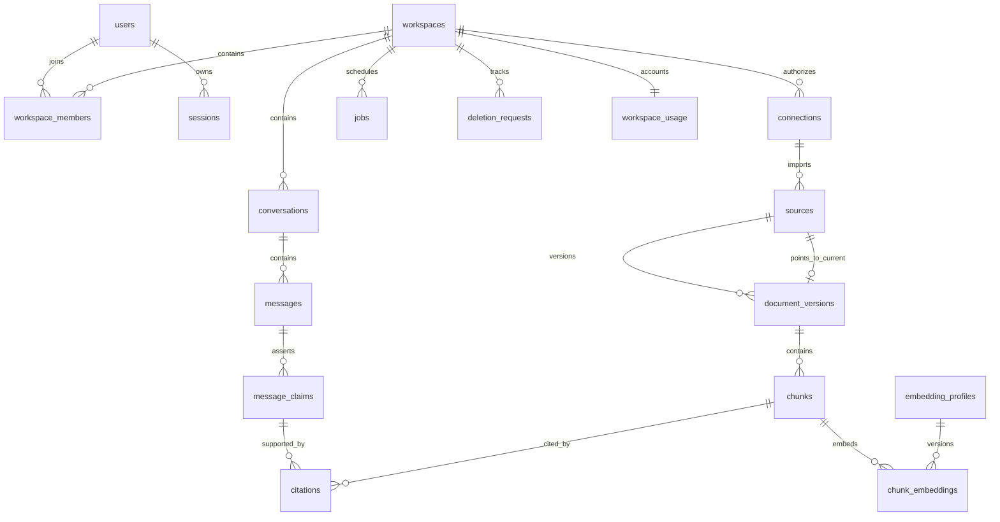

# Database Schema

> **Implementation status:** Specification complete; `0/33` specified tables
> currently have application migrations. PostgreSQL/pgvector initialization is
> foundation only. See
> [`IMPLEMENTATION_STATUS.md`](IMPLEMENTATION_STATUS.md).

## Goals and ownership

PostgreSQL is the durable source of truth for identity, workspace membership,
provider connections, searchable source versions, conversations, jobs,
deletion progress, quota usage, and audit events. Redis is disposable queue and
cache transport; object storage holds large encrypted artifacts under opaque
keys.

This stage owns relational entities, constraints, row-level security, indexes,
transaction boundaries, migration rules, and database test requirements. HTTP
representations belong to [`05_API_SPECIFICATION.md`](05_API_SPECIFICATION.md),
connector payloads to [`06_CONNECTOR_FRAMEWORK.md`](06_CONNECTOR_FRAMEWORK.md),
chunk production to [`07_INDEXING_PIPELINE.md`](07_INDEXING_PIPELINE.md), and
retention policy durations to
[`08_SECURITY_AND_PRIVACY.md`](08_SECURITY_AND_PRIVACY.md).

The schema is designed now; SQLAlchemy models and Alembic migrations are
implemented in the database phase after the dependent contracts are complete.
No application feature may create an unreviewed table outside this catalog.

## Extensions and database baseline

The application uses PostgreSQL 16 with these explicitly installed extensions:

- `citext` for case-insensitive identity uniqueness;
- `pg_trgm` for title, filename, path, and symbol similarity; and
- `vector` from pgvector for embedding storage and cosine search.

Extensions are installed by a privileged infrastructure migration. Runtime API
and worker roles cannot create extensions, schemas, roles, or databases.
Application tables live in the `app` schema; migration history lives in the
default Alembic version table. All timestamps are `TIMESTAMPTZ` in UTC.

## Naming and type conventions

- Table and column names use `snake_case`; primary keys are application-created
  UUIDs and are never reused.
- Random entity IDs use UUIDv4. Deterministic chunk IDs use UUIDv5 over the
  document-version ID, chunker version, chunk index, and chunk hash.
- Money, quotas, byte counts, token counts, sequence numbers, and attempts use
  integer types, never floating point.
- Relevance and embedding values may use floating-point types but are never
  presented as factual confidence.
- Lifecycle rows record the timestamps needed to explain their state. Rows that
  accept concurrent user or worker edits expose integer `lock_version`; other
  updates use row locks or atomic conditional statements.
- Status and kind columns use `TEXT` plus named `CHECK` constraints instead of
  PostgreSQL enums so expand/contract migrations remain practical.
- JSONB is limited to provider-specific or forward-compatible metadata. Fields
  used for authorization, lifecycle, joins, quotas, or common filters require
  typed columns or normalized tables.
- JSONB values must be objects, have documented size limits, and cannot contain
  credentials, document bodies, raw model prompts, or unsanitized errors.
- Every tenant-owned table contains `workspace_id` directly even when it could
  be derived through a foreign key.
- Tenant parent tables expose `UNIQUE (workspace_id, id)` so child tables use
  composite foreign keys that reject cross-workspace relationships.

## Core relational invariants

- One authenticated request uses one trusted transaction-local workspace and
  user context. Missing context returns no tenant rows and cannot write them.
- A user cannot hold duplicate membership in a workspace, and every workspace
  always has at least one active owner outside a deletion transaction.
- Provider credentials are encrypted envelopes, never plaintext columns.
- A source external ID is unique within its connection.
- A source is searchable only through `sources.current_document_version_id`;
  pending or failed replacements never become visible.
- A chunk belongs to exactly one immutable document version. Updating indexed
  chunk content in place is forbidden.
- An embedding is tied to one chunk and one embedding profile; vectors from
  incompatible profiles are never compared.
- Every citation's claim, message, source, document version, and chunk must
  belong to the same workspace and lineage.
- Provider cursors advance in the same transaction that durably commits all
  corresponding source changes and outbox events.
- Retried jobs use a stable idempotency key and cannot create duplicate visible
  state.
- Disconnect and deletion state excludes content from authorization and search
  immediately, before background hard deletion finishes.

## Relationship overview

## Identity and workspace tables

### users

| Column | Type and rules |
| --- | --- |
| `id` | UUID primary key |
| `email` | CITEXT not null, globally unique |
| `password_hash` | TEXT null for social-only accounts; Argon2id encoded value only |
| `full_name` | TEXT not null with bounded length |
| `status` | TEXT check `pending_verification`, `active`, `suspended`, `deleting` |
| `email_verified_at` | TIMESTAMPTZ null |
| `created_at`, `updated_at` | TIMESTAMPTZ not null |
| `lock_version` | INTEGER not null default 1 |

Email uniqueness does not replace normalized social identity uniqueness.
Changing an email requires a new verification transaction and optimistic lock.

### auth_identities

| Column | Type and rules |
| --- | --- |
| `id` | UUID primary key |
| `user_id` | UUID not null FK to `users`, cascade on user hard deletion |
| `issuer` | TEXT not null |
| `subject` | TEXT not null |
| `email_at_link_time` | CITEXT null |
| `created_at`, `last_login_at` | TIMESTAMPTZ |

`UNIQUE (issuer, subject)` prevents one upstream identity from linking to two
users. Provider login tokens are not stored here.

### one_time_tokens

| Column | Type and rules |
| --- | --- |
| `id` | UUID primary key |
| `user_id` | UUID not null FK to `users`, cascade |
| `purpose` | TEXT check `verify_email`, `reset_password`, `change_email` |
| `token_hash` | BYTEA not null unique; raw token is never stored |
| `expires_at`, `consumed_at` | TIMESTAMPTZ, consumed nullable |
| `attempt_count` | SMALLINT not null default 0 with nonnegative check |
| `created_at` | TIMESTAMPTZ not null |

An atomic conditional update sets `consumed_at` only when the hash, purpose,
user state, and expiry are valid.

### sessions

| Column | Type and rules |
| --- | --- |
| `id` | UUID primary key |
| `user_id` | UUID not null FK to `users`, cascade |
| `refresh_token_hash` | BYTEA not null unique |
| `family_id` | UUID not null for rotation and replay-family revocation |
| `issued_at`, `expires_at` | TIMESTAMPTZ not null |
| `rotated_at`, `revoked_at` | TIMESTAMPTZ null |
| `replaced_by_session_id` | UUID null self-FK, set null on deletion |
| `device_metadata` | JSONB not null default empty object, sanitized and bounded |
| `last_seen_at` | TIMESTAMPTZ null |

Only hashes of refresh tokens are stored. A detected replay revokes the complete
`family_id` in one transaction.

### workspaces

| Column | Type and rules |
| --- | --- |
| `id` | UUID primary key |
| `name` | TEXT not null |
| `plan` | TEXT check `free`, `paid`, `internal` |
| `status` | TEXT check `active`, `suspended`, `deleting` |
| `authorization_version` | BIGINT not null default 1 |
| `search_index_generation` | BIGINT not null default 1 |
| `created_at`, `updated_at` | TIMESTAMPTZ not null |
| `lock_version` | INTEGER not null default 1 |

Authorization changes increment `authorization_version`; searchable promotions
and removals increment `search_index_generation`. Both values participate in
safe search-cache keys.

### workspace_members

| Column | Type and rules |
| --- | --- |
| `workspace_id` | UUID FK to `workspaces`, cascade |
| `user_id` | UUID FK to `users`, cascade |
| `role` | TEXT check `owner`, `admin`, `member` |
| `status` | TEXT check `active`, `suspended`, `deleting` |
| `created_at`, `updated_at` | TIMESTAMPTZ not null |

The primary key is `(workspace_id, user_id)`. Removing or suspending membership
increments the workspace authorization version. Owner removal uses a locked
transaction that proves another active owner remains.

### oauth_transactions

| Column | Type and rules |
| --- | --- |
| `id` | UUID primary key |
| `workspace_id`, `user_id` | Composite FK to active membership |
| `provider` | TEXT check `google`, `github_login` |
| `state_hash`, `nonce_hash` | BYTEA not null unique values; raw secrets not stored |
| `pkce_verifier_ciphertext`, `encrypted_data_key`, `key_version` | Encrypted envelope fields, nullable only when PKCE is unsupported |
| `redirect_path` | TEXT not null, relative allowlisted path only |
| `expires_at`, `consumed_at`, `created_at` | TIMESTAMPTZ |

Consumption is single-use and atomic. Expired or consumed rows are purged by a
scheduled privacy job.

## Connection and desktop tables

### connections

| Column | Type and rules |
| --- | --- |
| `id` | UUID primary key |
| `workspace_id`, `owner_user_id` | Composite FK to workspace membership |
| `provider` | TEXT check `google`, `github`, `local_files` |
| `external_account_id_hash` | BYTEA null; unique with workspace and provider while active |
| `display_label` | TEXT not null, user-safe and bounded |
| `status` | TEXT check `pending`, `active`, `reauthorization_required`, `error`, `deleting`, `deleted` |
| `credential_ciphertext`, `encrypted_data_key`, `key_version` | Encrypted envelope fields, nullable after immediate revocation or when no long-lived credential exists |
| `last_successful_sync_at` | TIMESTAMPTZ null |
| `last_error_code` | TEXT null, sanitized code only |
| `created_at`, `updated_at`, `deleted_at` | TIMESTAMPTZ |
| `lock_version` | INTEGER not null default 1 |

The encrypted data key and credential ciphertext are cleared in the disconnect
transaction before deletion work is queued. `deleted` rows retain only bounded,
non-secret tombstone metadata until the retention policy permits hard deletion.

### connection_scopes

| Column | Type and rules |
| --- | --- |
| `workspace_id`, `connection_id` | Composite FK to `connections`, cascade |
| `scope` | TEXT not null |
| `granted_at` | TIMESTAMPTZ not null |

The primary key is `(connection_id, scope)`. Only the server's provider-specific
read-only allowlist may be inserted. Scope changes increment
`authorization_version` and require reconciliation.

### connection_cursors

| Column | Type and rules |
| --- | --- |
| `id` | UUID primary key |
| `workspace_id`, `connection_id` | Composite FK to `connections`, cascade |
| `stream` | TEXT not null, such as `gmail_history` or `drive_changes` |
| `cursor` | JSONB not null object with provider-specific size limit |
| `cursor_version` | BIGINT not null default 1 |
| `committed_at`, `updated_at` | TIMESTAMPTZ not null |

`UNIQUE (connection_id, stream)` permits independent provider feeds. Cursor
updates use optimistic version checks and occur only with durable changes.

### source_collections

| Column | Type and rules |
| --- | --- |
| `id` | UUID primary key |
| `workspace_id`, `connection_id` | Composite FK to `connections`, cascade |
| `provider_external_id` | TEXT not null |
| `kind` | TEXT check `repository`, `folder`, `mailbox` |
| `name` | TEXT not null |
| `parent_collection_id` | UUID null self-FK constrained to the same workspace and connection |
| `path_display` | TEXT null; provider-safe display path, never an absolute local path |
| `selected` | BOOLEAN not null default false |
| `status` | TEXT check `active`, `removed`, `deleting` |
| `created_at`, `updated_at` | TIMESTAMPTZ not null |

`UNIQUE (connection_id, kind, provider_external_id)` provides stable repository
and folder filter IDs.

### devices

| Column | Type and rules |
| --- | --- |
| `id` | UUID primary key |
| `workspace_id`, `user_id` | Composite FK to active membership |
| `connection_id` | UUID not null FK to a same-workspace `local_files` connection |
| `name`, `platform`, `app_version` | Bounded TEXT fields |
| `public_key` | BYTEA not null unique |
| `credential_hash` | BYTEA not null unique; raw device secret stays in OS keychain |
| `status` | TEXT check `pending`, `active`, `revoked`, `deleting` |
| `last_seen_at`, `created_at`, `updated_at`, `revoked_at` | TIMESTAMPTZ |
| `lock_version` | INTEGER not null default 1 |

Device revocation increments the workspace authorization version and disables
all device-folder sync before background cleanup.

### device_folders

| Column | Type and rules |
| --- | --- |
| `id` | UUID primary key |
| `workspace_id`, `device_id` | Composite FK to `devices`, cascade |
| `external_root_id` | TEXT not null stable client-generated identifier |
| `display_name` | TEXT not null |
| `absolute_path_hash` | BYTEA not null; absolute paths are not stored in cloud tables |
| `ignore_rules_hash` | BYTEA not null |
| `status` | TEXT check `active`, `removed`, `deleting` |
| `created_at`, `updated_at` | TIMESTAMPTZ not null |

`UNIQUE (device_id, external_root_id)` makes manifest retries idempotent.

### provider_events

| Column | Type and rules |
| --- | --- |
| `id` | UUID primary key |
| `workspace_id`, `connection_id` | Composite FK to `connections`, cascade |
| `provider_event_id` | TEXT not null |
| `event_type` | TEXT not null |
| `payload_hash` | BYTEA not null; raw provider body is not retained here |
| `signature_verified_at` | TIMESTAMPTZ not null |
| `status` | TEXT check `accepted`, `processed`, `ignored`, `failed` |
| `received_at`, `processed_at` | TIMESTAMPTZ, processed nullable |

`UNIQUE (connection_id, provider_event_id)` rejects webhook replay and duplicate
delivery before creating jobs.

## Source and index tables

### sources

| Column | Type and rules |
| --- | --- |
| `id` | UUID primary key |
| `workspace_id`, `connection_id` | Composite FK to `connections`, cascade during hard deletion |
| `provider` | TEXT check `gmail`, `google_drive`, `github`, `local_files` |
| `external_id` | TEXT not null |
| `source_type` | TEXT check `email`, `attachment`, `file`, `issue`, `pull_request`, `review`, `commit`, `code` |
| `title`, `mime_type`, `file_extension` | Bounded TEXT, MIME and extension nullable |
| `canonical_url` | TEXT null, validated provider URL only |
| `author_display` | TEXT null, presentation only |
| `source_timestamp`, `source_timestamp_kind` | TIMESTAMPTZ plus TEXT check `sent`, `modified`, `authored`, `created` |
| `content_hash`, `permissions_hash` | BYTEA not null |
| `current_document_version_id` | UUID null; composite deferred FK back to this source's document version |
| `state` | TEXT check `active`, `permission_blocked`, `deleting`, `deleted` |
| `metadata` | JSONB not null default empty object, bounded provider metadata |
| `created_at`, `updated_at`, `deleted_at` | TIMESTAMPTZ |
| `lock_version` | INTEGER not null default 1 |

`UNIQUE (connection_id, external_id)` is the provider idempotency boundary.
Only rows in `active` state with a non-null current version are searchable.
The pointer constraint is `FOREIGN KEY (id, current_document_version_id)
REFERENCES document_versions(source_id, id) DEFERRABLE INITIALLY DEFERRED`,
added after both sides exist so it cannot point to another source's version.

### source_people

| Column | Type and rules |
| --- | --- |
| `id` | UUID primary key |
| `workspace_id`, `source_id` | Composite FK to `sources`, cascade |
| `relationship` | TEXT check `author`, `sender`, `recipient`, `owner`, `participant`, `reviewer` |
| `identity_kind` | TEXT check `email`, `provider_user`, `display_name` |
| `normalized_identifier` | CITEXT not null |
| `display_name` | TEXT null |

`UNIQUE (source_id, relationship, identity_kind, normalized_identifier)`
supports deterministic person filters without searching arbitrary JSON.

### source_collection_memberships

| Column | Type and rules |
| --- | --- |
| `workspace_id`, `source_id` | Composite FK to `sources`, cascade |
| `collection_id` | UUID FK to a same-workspace, same-connection collection |
| `relationship` | TEXT check `direct`, `ancestor` |

The primary key is `(source_id, collection_id)`. Materialized ancestor rows make
folder and repository filters bounded and preserve immutable collection IDs.

### document_versions

| Column | Type and rules |
| --- | --- |
| `id` | UUID primary key |
| `workspace_id`, `source_id` | Composite FK to `sources`, cascade |
| `version_key` | BYTEA not null deterministic fingerprint |
| `state` | TEXT check `pending`, `ready`, `failed`, `superseded`, `deleting` |
| `normalized_text` | TEXT null while pending; state constraint requires a value when `ready` |
| `language`, `parser_version`, `chunker_version` | TEXT not null |
| `content_hash`, `permissions_hash` | BYTEA not null |
| `token_count`, `extracted_bytes` | BIGINT nonnegative checks |
| `object_storage_key` | TEXT null opaque key, never a URL |
| `failure_code` | TEXT null sanitized code |
| `created_at`, `ready_at`, `superseded_at` | TIMESTAMPTZ, latter two nullable |

`UNIQUE (source_id, version_key)` makes repeat indexing idempotent. A failed
version contains no searchable chunks and cannot replace the source pointer.
Document versions are immutable after `ready` except for lifecycle timestamps.

### chunks

| Column | Type and rules |
| --- | --- |
| `id` | UUID primary key, deterministic UUIDv5 |
| `workspace_id`, `document_version_id` | Composite FK to `document_versions`, cascade |
| `chunk_index` | INTEGER nonnegative |
| `chunk_hash` | BYTEA not null |
| `heading_path` | TEXT[] not null default empty array |
| `content` | TEXT not null |
| `search_config` | REGCONFIG not null |
| `search_vector` | TSVECTOR generated and stored from `search_config` and content |
| `token_count` | INTEGER positive |
| `start_offset`, `end_offset` | INTEGER null with ordered nonnegative range check |
| `page_number`, `line_start`, `line_end` | INTEGER null with positive and ordered checks |
| `narrow_section_key` | TEXT null |
| `metadata` | JSONB not null default empty object, bounded extraction metadata |

Both `(document_version_id, chunk_index)` and `(document_version_id, chunk_hash)`
are unique. Stored text and offsets never change after insertion.

### embedding_profiles

| Column | Type and rules |
| --- | --- |
| `id` | SMALLINT generated identity primary key |
| `provider`, `model` | TEXT not null |
| `dimensions` | INTEGER not null check equal to 1536 for the MVP table |
| `distance_metric` | TEXT check `cosine` |
| `status` | TEXT check `building`, `active`, `retired` |
| `created_at`, `activated_at` | TIMESTAMPTZ, activated nullable |

Only one profile may be active. Model adapters must emit exactly 1536 finite
values. A future dimension change uses an expand/contract table or typed column,
dual writes, a backfill, benchmark validation, and an atomic profile switch;
it never reinterprets existing vectors.

### chunk_embeddings

| Column | Type and rules |
| --- | --- |
| `workspace_id`, `chunk_id` | Composite FK to `chunks`, cascade |
| `embedding_profile_id` | SMALLINT FK to `embedding_profiles`, restrict deletion |
| `embedding` | VECTOR(1536) not null |
| `created_at` | TIMESTAMPTZ not null |

The primary key is `(chunk_id, embedding_profile_id)`. A database constraint or
write-path validation rejects non-finite and zero-norm vectors. Search always
filters workspace and active profile before distance ordering.

## Search and conversation tables

### search_requests

| Column | Type and rules |
| --- | --- |
| `id` | UUID primary key and public request correlation ID |
| `workspace_id`, `user_id` | Composite FK to workspace membership |
| `conversation_id` | UUID null, same-workspace FK |
| `mode` | TEXT check `results`, `answer` |
| `query_text` | TEXT not null, private user content with bounded length |
| `normalized_plan` | JSONB not null, schema-versioned and bounded |
| `planner_version`, `ranker_version`, `embedding_profile_id` | Version fields |
| `index_generation`, `authorization_version` | BIGINT not null snapshots |
| `status` | TEXT check `running`, `completed`, `insufficient_evidence`, `failed`, `cancelled` |
| `insufficient_reason`, `error_code` | TEXT null, checked and sanitized |
| `latency_ms`, `result_count`, `context_tokens` | INTEGER null with nonnegative checks |
| `created_at`, `completed_at`, `purge_after` | TIMESTAMPTZ |

Clearing standalone search history hard-deletes eligible request rows.
Conversation messages detach through their nullable request FK and remain until
the user deletes that conversation or its separate retention policy expires.
Operational metrics use aggregated telemetry rather than retaining query text
beyond its policy.

### conversations

| Column | Type and rules |
| --- | --- |
| `id` | UUID primary key |
| `workspace_id`, `user_id` | Composite FK to workspace membership |
| `title` | TEXT not null, bounded |
| `status` | TEXT check `active`, `deleted` |
| `created_at`, `updated_at`, `deleted_at` | TIMESTAMPTZ |

Conversation deletion immediately excludes it through status and then hard
deletes messages, claims, and citations in the same request or deletion job.

### messages

| Column | Type and rules |
| --- | --- |
| `id` | UUID primary key |
| `workspace_id`, `conversation_id` | Composite FK to `conversations`, cascade |
| `search_request_id` | UUID null, same-workspace FK, set null if history is cleared separately |
| `role` | TEXT check `user`, `assistant` |
| `status` | TEXT check `pending`, `complete`, `insufficient_evidence`, `interrupted`, `failed` |
| `content` | TEXT not null; assistant content only after grounding validation |
| `model`, `model_response_id` | TEXT null; response ID contains no credential |
| `input_tokens`, `output_tokens`, `latency_ms` | INTEGER null with nonnegative checks |
| `created_at`, `completed_at` | TIMESTAMPTZ |

An assistant message cannot enter `complete` until all material claims and
citations validate in the same transaction.

### message_claims

| Column | Type and rules |
| --- | --- |
| `id` | UUID primary key |
| `workspace_id`, `message_id` | Composite FK to an assistant `messages` row, cascade |
| `claim_index` | INTEGER nonnegative |
| `text` | TEXT not null |
| `material` | BOOLEAN not null |

`UNIQUE (message_id, claim_index)` preserves answer order. A deferred constraint
trigger requires at least one citation for every material claim before its
message can become complete.

### citations

| Column | Type and rules |
| --- | --- |
| `id` | UUID primary key |
| `workspace_id`, `message_id`, `claim_id` | Composite lineage FKs, cascade |
| `source_id`, `document_version_id`, `chunk_id` | Composite same-workspace and same-lineage FKs |
| `citation_index` | INTEGER nonnegative |
| `excerpt` | TEXT not null server-derived bounded snapshot |
| `rank_score` | DOUBLE PRECISION null finite check |
| `created_at` | TIMESTAMPTZ not null |

`UNIQUE (message_id, citation_index)` and `UNIQUE (claim_id, chunk_id)` prevent
duplicate markers. Deleting a source or chunk cascades its citation so stale
private excerpts cannot survive source deletion; affected saved answers are
marked incomplete or removed by the same deletion workflow.

## Job, deletion, quota, and audit tables

### api_idempotency_keys

| Column | Type and rules |
| --- | --- |
| `id` | UUID primary key |
| `workspace_id`, `user_id` | Composite FK to active membership, cascade with workspace deletion |
| `key_hash` | BYTEA not null; raw client key is never stored |
| `method`, `route_template` | Bounded TEXT identifying the canonical operation |
| `request_hash` | BYTEA not null over the canonical validated body and relevant headers |
| `status` | TEXT check `processing`, `completed`, `failed` |
| `response_status` | SMALLINT null with valid HTTP status check |
| `response_body` | JSONB null, bounded and forbidden from containing tokens, URLs, source content, or excerpts |
| `resource_type`, `resource_id` | TEXT and UUID null durable replay target |
| `created_at`, `updated_at`, `expires_at` | TIMESTAMPTZ not null |

`UNIQUE (workspace_id, user_id, method, route_template, key_hash)` reserves a
key atomically. Changed request hashes conflict. Sensitive-capability endpoints
store only a resource pointer and regenerate an authorized short-lived response
instead of replaying secrets.

### jobs

| Column | Type and rules |
| --- | --- |
| `id` | UUID primary key |
| `workspace_id` | UUID FK to `workspaces`, cascade during hard deletion |
| `connection_id`, `source_id`, `deletion_request_id` | Nullable same-workspace FKs |
| `job_type` | TEXT check `sync`, `index`, `embed`, `delete`, `export`, `reconcile` |
| `queue` | TEXT check `sync`, `index`, `embedding`, `deletion`, `privacy` |
| `idempotency_key` | TEXT not null bounded opaque value |
| `status` | TEXT check `pending`, `leased`, `retry_wait`, `completed`, `failed`, `dead_letter` |
| `priority`, `attempt_count`, `max_attempts` | INTEGER with bounded checks |
| `available_at`, `lease_expires_at` | TIMESTAMPTZ, lease nullable |
| `lease_owner` | TEXT null opaque worker ID |
| `error_code` | TEXT null sanitized code |
| `payload` | JSONB not null identifiers and operation metadata only |
| `created_at`, `updated_at`, `completed_at` | TIMESTAMPTZ |

`UNIQUE (workspace_id, job_type, idempotency_key)` prevents duplicate logical
work. Workers claim jobs with a short transaction using `FOR UPDATE SKIP LOCKED`.
Document bodies, email bodies, credentials, and raw provider payloads are
forbidden in `payload`.

### job_attempts

| Column | Type and rules |
| --- | --- |
| `id` | UUID primary key |
| `workspace_id`, `job_id` | Composite FK to `jobs`, cascade |
| `attempt_number` | INTEGER positive |
| `worker_id` | TEXT not null opaque identifier |
| `status` | TEXT check `running`, `succeeded`, `retryable_failure`, `permanent_failure`, `lease_expired` |
| `error_code`, `diagnostic_ref` | TEXT null, sanitized code and external restricted-log reference |
| `started_at`, `finished_at` | TIMESTAMPTZ, finished nullable |

`UNIQUE (job_id, attempt_number)` supports operator diagnosis without storing
sensitive error detail.

### outbox_events

| Column | Type and rules |
| --- | --- |
| `id` | UUID primary key |
| `workspace_id` | UUID FK to `workspaces`, cascade |
| `aggregate_type`, `aggregate_id`, `event_type` | Bounded TEXT/UUID identifiers |
| `payload` | JSONB not null, identifiers and operation metadata only |
| `created_at`, `published_at` | TIMESTAMPTZ, published nullable |
| `publish_attempts` | INTEGER not null default 0 |

Outbox insertion occurs in the same transaction as the durable state change.
Publishing is idempotent by event ID; reconciliation republishes unacknowledged
events after Redis loss.

### deletion_requests

| Column | Type and rules |
| --- | --- |
| `id` | UUID primary key |
| `workspace_id`, `requested_by_user_id` | Workspace and member references; requester may later be null |
| `target_type` | TEXT check `account`, `connection`, `source`, `conversation`, `device` |
| `target_id` | UUID not null |
| `status` | TEXT check `pending`, `running`, `blocked`, `completed`, `failed` |
| `idempotency_key` | TEXT not null |
| `deadline_at` | TIMESTAMPTZ not null, at most 24 hours from confirmation for account/connection deletion |
| `receipt_token_hash` | BYTEA null unique; required for account deletion and never stored raw |
| `remaining_counts`, `failure_codes` | JSONB not null objects containing counts and sanitized codes only |
| `requested_at`, `started_at`, `completed_at`, `updated_at` | TIMESTAMPTZ |

`UNIQUE (workspace_id, target_type, target_id, idempotency_key)` makes confirmed
retries safe. Completion requires a reconciliation query proving no active
database rows or object keys remain for the target.

### workspace_usage

| Column | Type and rules |
| --- | --- |
| `workspace_id` | UUID primary key FK to `workspaces`, cascade |
| `indexed_source_count` | BIGINT nonnegative |
| `extracted_bytes` | BIGINT nonnegative |
| `updated_at` | TIMESTAMPTZ not null |
| `lock_version` | INTEGER not null default 1 |

First promotion, replacement, and hard deletion apply the correct delta to
active-source count and active extracted bytes in the same transaction as
visible state. The write path locks this row and checks the 25,000-item and
10-GB limits before promotion. Superseded-version physical storage is tracked
operationally until cleanup but does not double-charge active-content quota.
Periodic reconciliation computes counts from current source pointers and
repairs drift with an audit event.

### audit_events

| Column | Type and rules |
| --- | --- |
| `id` | UUID primary key |
| `workspace_id` | UUID null FK to `workspaces`, set null after workspace hard deletion |
| `workspace_ref_hash` | BYTEA not null keyed pseudonymous reference |
| `actor_user_id` | UUID null FK to `users`, set null |
| `action`, `target_type`, `outcome` | Bounded checked TEXT values |
| `target_ref_hash` | BYTEA null; raw deleted target IDs need not be retained |
| `request_id` | UUID null |
| `metadata` | JSONB not null allowlisted content-free fields only |
| `created_at` | TIMESTAMPTZ not null |

Audit events are append-only to application roles. They never contain tokens,
queries, document content, excerpts, provider URLs, raw IP addresses, or
unsanitized errors. Rows whose workspace has been deleted are invisible to
tenant roles and accessible only to the restricted audit role under the
retention policy.

## Atomic lifecycle transactions

### Searchable-version promotion

1. Insert a `pending` document version, chunks, and embeddings without changing
   the current source pointer.
2. Validate expected chunk counts, hashes, token and byte quotas, embedding
   profile, and source permission hash.
3. Lock the source and `workspace_usage` rows and verify the source has not
   changed or entered deletion.
4. Mark the new version `ready`, update
   `sources.current_document_version_id`, mark the previous version
   `superseded`, update quota counters, and increment
   `search_index_generation` in one transaction.
5. Insert cleanup and cache-invalidation outbox events in that transaction.

Failure before commit leaves the old pointer untouched. Search joins through
the pointer and can never see pending chunks.

### Sync cursor advancement

A sync batch upserts sources, records deletions or permission changes, creates
required jobs, inserts outbox events, and advances its versioned connection
cursor in one transaction. A stale cursor version aborts the transaction for a
safe retry. Provider pagination never advances based only on in-memory work.

### Session rotation

Refresh-token use locks the current session, rejects expiry, revocation, or
prior rotation, inserts the replacement hash, and marks the old row rotated in
one transaction. Reuse of an already rotated token revokes the family.

### Disconnect and deletion

The confirmation transaction reauthorizes the actor, moves the target to
`deleting`, clears credentials where applicable, increments authorization and
index generations, creates an idempotent deletion request and privacy-queue
job, and inserts the outbox event. Search and sync eligibility stop at commit;
physical deletion continues in bounded batches and finishes with reconciliation.

## Foreign-key deletion behavior

| Parent deletion | Required database behavior |
| --- | --- |
| Workspace hard deletion | Cascade tenant content, jobs, usage, and memberships; set nullable audit workspace reference to null |
| User hard deletion | Cascade sessions, tokens, and identities; delete personal membership/content according to the deletion request; set audit actor to null |
| Connection hard deletion | Cascade scopes, cursors, collections, provider events, sources, versions, chunks, embeddings, and dependent citations |
| Source hard deletion | Cascade versions, chunks, embeddings, people, collection memberships, and citations |
| Conversation hard deletion | Cascade messages, claims, and citations |
| Embedding profile deletion | Restrict while any embedding references it; retired profiles are purged only after backfill and rollback windows |

Cascades are a final integrity mechanism, not the deletion workflow. Workers
delete in bounded order so progress and object-storage reconciliation remain
observable and large transactions do not monopolize locks.

## Row-level security and database roles

Roles are separated:

- `app_migrator` is a NOLOGIN owner used only by the migration job;
- `app_api` is NOSUPERUSER and NOBYPASSRLS for request transactions;
- `app_worker` is NOSUPERUSER and NOBYPASSRLS for job transactions;
- `app_audit_reader` has narrowly logged read access to retained audit rows; and
- application processes never connect as the table owner or a superuser.

RLS is enabled and forced on every tenant-owned table: `workspace_members`,
`oauth_transactions`, `connections`, `connection_scopes`,
`connection_cursors`, `source_collections`, `devices`, `device_folders`,
`provider_events`, `sources`, `source_people`,
`source_collection_memberships`, `document_versions`, `chunks`,
`chunk_embeddings`, `search_requests`, `conversations`, `messages`,
`message_claims`, `citations`, `api_idempotency_keys`, `jobs`, `job_attempts`,
`outbox_events`, `deletion_requests`, and `workspace_usage`.

After session authentication, the API sets `app.user_id` with `SET LOCAL`.
User-scoped membership policy permits that user to read only their own active
membership rows; after validating the requested membership, the API sets
`app.workspace_id` for all tenant work. Connection-pool check-in rolls back any
open transaction; context is never set at session scope.

Pre-authentication and asynchronous bootstrap cannot rely on tenant context, so
generic table privileges are not used. The schema exposes minimal
`SECURITY DEFINER` functions with fixed `search_path`, strict parameter types,
revoked `PUBLIC` execution, bounded return columns, and audit events:

- login identity lookup and atomic refresh-token rotation operate by email,
  issuer/subject, or token hash without allowing identity-table enumeration;
- OAuth callback consumption operates by state hash, validates single use and
  expiry, and returns the authoritative user and workspace IDs;
- webhook ingress resolves a connection from a verified provider installation
  identifier and atomically deduplicates the event; and
- job and outbox claim functions accept an opaque row ID, atomically lease the
  runnable row, and return its authoritative workspace ID and identifier-only
  payload.

After a job or outbox claim, the worker opens a new transaction, sets context
from the returned durable workspace, and performs ordinary RLS-constrained
work. These functions cannot accept a caller-selected workspace as authority,
return credentials or content, issue arbitrary SQL, or disable RLS. Their
definitions and grants receive the same cross-tenant tests as policies.

Policies use both `USING` and `WITH CHECK`, compare the row's direct
`workspace_id` with a safe helper around
`current_setting('app.workspace_id', true)`, and verify active membership for
user-facing roles. Missing, malformed, suspended, or deleting context evaluates
false. `FORCE ROW LEVEL SECURITY` ensures table-owner mistakes do not become an
application bypass.

`users`, `auth_identities`, `one_time_tokens`, and `sessions` use user-scoped
policies after identity bootstrap; application roles have no unrestricted
pre-authentication reads. `embedding_profiles` is a read-only global lookup.
`audit_events` uses a dedicated policy that permits tenant access only while its
workspace reference exists; orphaned retention rows require the audited reader
role.

RLS is defense in depth. Repository methods still include workspace predicates
before full-text or vector ordering, and every composite foreign key prevents a
valid tenant row from referencing another tenant's entity.

## Required indexes

Every foreign-key column or leading composite FK receives a B-tree index. The
minimum workload indexes are:

- unique `users(email)` through CITEXT and unique
  `auth_identities(issuer, subject)`;
- `sessions(user_id, expires_at)` plus partial active-family indexes;
- `workspace_members(user_id, status)` and
  `workspace_members(workspace_id, role, status)`;
- partial active connection uniqueness on workspace, provider, and external
  account hash;
- `connections(workspace_id, status)` and
  `connection_cursors(connection_id, stream)`;
- `sources(workspace_id, connection_id, state)` and unique
  `sources(connection_id, external_id)`;
- GIN `sources(title gin_trgm_ops)` plus B-tree workspace/provider/source-type
  and source-timestamp filter indexes;
- `source_people(workspace_id, normalized_identifier, relationship)`;
- `source_collection_memberships(workspace_id, collection_id, source_id)`;
- `document_versions(workspace_id, source_id, state, created_at DESC)`;
- GIN `chunks(search_vector)` and
  `chunks(workspace_id, document_version_id, chunk_index)`;
- `chunk_embeddings(workspace_id, embedding_profile_id, chunk_id)` and HNSW
  `chunk_embeddings(embedding vector_cosine_ops)` with initial `m = 16` and
  `ef_construction = 64`;
- `search_requests(workspace_id, user_id, created_at DESC)` with partial index
  for unpurged history;
- `messages(workspace_id, conversation_id, created_at)` and all citation
  lineage keys;
- unique API idempotency reservation plus
  `api_idempotency_keys(workspace_id, expires_at)` cleanup index;
- partial runnable-job index on `(queue, priority DESC, available_at, created_at)`
  for `pending` and `retry_wait` rows;
- partial unpublished-outbox index on `(created_at)` where `published_at` is
  null;
- `deletion_requests(status, deadline_at)` for incomplete requests; and
- BRIN time indexes for high-volume append-only job attempts and audit events
  after measured table growth justifies partitioning.

Vector queries include workspace and active-profile predicates in SQL before
distance ordering. With pgvector 0.8, filtered approximate search enables
iterative scans and uses a benchmarked `hnsw.ef_search`; release tests compare
filtered HNSW recall against an exact workspace-scoped baseline. If the product
cannot meet Recall@10 because of filtering, it uses exact search or
workspace-hash partitioning before raising global candidate limits.

Query-plan tests use production-like cardinalities and fail on sequential scans
for critical point lookups, job claims, and full-text paths unless the fixture
is intentionally below the planner threshold.

## Quotas, retention, and data minimization

- The authoritative MVP limits are 25,000 indexed sources and 10 GB extracted
  content per workspace. Quota checks lock `workspace_usage` before promotion.
- A file larger than 100 MB is rejected before a document version becomes
  searchable and does not increment usage.
- Redis enforces request-rate windows; PostgreSQL stores durable aggregate usage
  needed for billing and reconciliation, not every rejected request.
- `purge_after` or lifecycle state supports the durations selected in the
  security stage. A nullable expiry never means "retain forever" without an
  explicit policy.
- Credentials, raw tokens, provider webhook bodies, absolute local paths, and
  full private content are excluded from audit, job, outbox, and error fields.
- Object keys are opaque and are reconciled against database ownership during
  deletion and restore tests.
- Backups preserve RLS metadata and deletion tombstones and expire under the
  documented backup policy; restores never reactivate deleted accounts or
  connections.

## Migration and rollback strategy

Alembic is the only application-schema migration mechanism. Every revision has
a stable identifier, reviewed upgrade path, compatibility notes, data-backfill
plan when needed, and a tested rollback or roll-forward recovery procedure.

Migration rules:

1. Use expand/contract changes across releases: add nullable structures, deploy
   compatible dual-read or dual-write code, backfill in resumable batches,
   validate, switch reads, then remove old structures in a later release.
2. Do not combine a destructive drop with the release that stops using the
   column, table, index, status, or payload version.
3. Set bounded `lock_timeout` and `statement_timeout`; avoid table rewrites and
   unbounded data updates in deployment transactions.
4. Create large indexes with `CREATE INDEX CONCURRENTLY` in Alembic autocommit
   blocks and verify validity before use.
5. Add constraints as `NOT VALID` when appropriate, validate separately, then
   make writes depend on them.
6. Backfills use durable checkpoints and are safe to resume; they never advance
   source pointers until a complete new version validates.
7. Schema migrations run once before traffic shift using `app_migrator`; API
   and worker startup checks reject incompatible schema versions.
8. Extension upgrades, vector-dimension changes, partition changes, and RLS
   policy edits require staging restore, cross-tenant, performance, and rollback
   tests.

Downgrades that would discard accepted user data are intentionally blocked;
the recovery plan restores compatible application code or rolls forward.
Pre-migration backups are useful only after an automated restore test proves
tenant isolation and deletion state survive.

## Database test matrix

The database suite runs against the same PostgreSQL-major and extension versions
used by local Compose and CI. It must cover:

- applying all migrations to an empty database and upgrading from the previous
  released schema snapshot;
- schema linting for missing primary keys, foreign-key indexes, named checks,
  RLS enablement, `FORCE ROW LEVEL SECURITY`, and application-role ownership;
- two-workspace read, insert, update, delete, full-text, trigram, and vector
  isolation tests for every tenant table;
- missing-context, malformed-context, suspended-member, revoked-connection, and
  deleting-workspace fail-closed tests;
- composite-FK attempts to connect a child row to another workspace;
- duplicate API request, source, cursor, webhook, job, token, and chunk
  idempotency races;
- successful atomic version promotion and injected failures at every step that
  prove the previous version remains searchable;
- concurrent quota promotions that cannot exceed either workspace limit;
- cursor/outbox atomicity and worker lease expiry/reclaim behavior;
- session rotation, replay-family revocation, and one-time token consumption;
- immediate search exclusion followed by complete connection, source,
  conversation, device, and account deletion reconciliation;
- citation-lineage and material-claim constraints;
- filtered HNSW recall against exact cosine results, full-text relevance,
  trigram identifiers, and query-plan regression fixtures; and
- backup restore validation that preserves RLS, active source pointers,
  idempotency keys, audit integrity, and deletion tombstones.

Tests use synthetic private content and deterministic provider fixtures. They
never require real OAuth credentials or user data.

## Requirement coverage

| Requirement | Database support |
| --- | --- |
| `AUTH-001` | Users, identities, hashed one-time tokens, rotating session families, and membership-safe account state |
| `DESKTOP-001` | Scoped devices and folder roots without stored absolute paths, plus immediate revocation state |
| `GOOGLE-001` | Encrypted Google connection envelopes, read-only scope rows, selected collections, cursors, and deletion lifecycle |
| `GITHUB-001` | GitHub connection and repository collection boundaries plus deduplicated signed provider events |
| `SYNC-001` | Versioned cursors, idempotent jobs, attempts, outbox events, and sanitized visible error codes |
| `SEARCH-001` | Typed filter relations, promoted-version pointer, full-text/trigram/vector indexes, and pre-ranking workspace predicates |
| `ANSWER-001` | Search-request versions, bounded message lifecycle, structured claims, and insufficient-evidence state |
| `CITATION-001` | Same-workspace source/version/chunk lineage with cascading private excerpts and stable ordering |
| `CONNECTION-001` | Immediate credential clearing and access cutoff plus tracked, idempotent, reconciled deletion |
| `ACCOUNT-001` | Deleting account/workspace state, 24-hour deadline, cascade plan, progress counts, and content-free audit result |
| `SAFETY-001` | Forced RLS, composite tenant keys, identifier-only job payloads, and no content-triggered database authority |

## Stage 04 completion criteria

- Every durable product responsibility has an owning table or an explicitly
  named non-database owner.
- Every tenant table carries direct workspace scope, forced RLS, and composite
  relationship constraints.
- Authentication secrets, provider credentials, and device credentials are
  hashed or envelope-encrypted and never stored raw.
- Immutable document versions and an atomic source pointer prevent partial
  reindex visibility.
- Full-text, trigram, vector, metadata, queue, deletion, and lineage indexes are
  explicit and have query-plan or recall tests.
- Cursor advancement, outbox publication, session rotation, quota accounting,
  version promotion, and deletion cutoff have transaction boundaries.
- Cascades, retention hooks, backup behavior, and complete deletion
  reconciliation are defined.
- Migration rules support backward-compatible deploys, bounded locks,
  resumable backfills, and tested recovery.
- Every product requirement maps to concrete database support.
- `./scripts/validate-database-schema.sh` passes.
